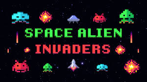

# Space Invader

## Description
This project is a Python implementation of a simplified Space Invader game with Q-Learning & deep-learning, a reinforcement learning algorithm. The game incorporates various components such as players, enemies, asteroids, bullets, and a reward system for training an agent to perform better over time.

## Project Structure

- **`main.py`**: The entry point of the application. It initializes the game and starts the training or playing loop.
- **`QGame.py`**: Contains the game logic specific to the Q-Learning agent, including environment interactions and state updates.
- **`Q_Table_Utils.py`**: Utilities for handling the Q-table, including initialization, updates, and saving/loading functionalities.
- **`Game.py`**: Defines the core gameplay mechanics and interactions.
- **`Common.py`**: Contains utility functions and shared constants used across the project.
- **`Player.py`**: Implements the player character's logic, including movement and shooting.
- **`Ennemy.py`**: Handles enemy behaviors, such as movement and interactions.
- **`Asteroid.py`**: Defines the logic for asteroids, including their movement and impact on the game.
- **`Bullet.py`**: Manages bullet properties, including their trajectory and collision handling.
- **`Setting.py`**: Configuration file for game settings, such as screen dimensions, player speed, and reward values.

## Features

- **Reinforcement Learning**: The game incorporates Q-Learning to train an agent to optimize its gameplay strategy.
- **Modular Design**: Components like players, enemies, and asteroids are implemented as separate modules for easier customization and debugging.
- **Customizable Settings**: The `Setting.py` file allows for easy adjustments to game parameters and training configurations.
- **Reward System**: The agent is rewarded for actions like hitting enemies and penalized for being hit or missing shots, fostering better performance over time.

## Installation

### Requirements
- Python 3.10 or Python 3.11

1. Clone the repository:
   ```bash
   git clone git@github.com:Carac92/space_invader.git
   ```

2. Navigate to the project directory:
   ```bash
   cd space_invader
   ```

3. Install required dependencies:
   ```bash
   pip install -r requirements.txt
   ```

## Usage

### Playing the Game
To play the game manually, run:
```bash
python main.py
```

## Configuration
Modify `Setting.py` to adjust parameters such as:
- Game screen dimensions
- Learning rate and discount factor for Q-Learning
- Reward and penalty values

## File Descriptions

### Core Components
- **`Player.py`**: Implements player-specific actions and attributes.
- **`Ennemy.py`**: Manages enemy behaviors.
- **`Asteroid.py`**: Controls asteroid properties and behaviors.
- **`Bullet.py`**: Handles bullets' movements and interactions.

### Utilities
- **`Q_Table_Utils.py`**: Includes functions for initializing, updating, and saving/loading the Q-table.
- **`Common.py`**: Contains shared utility functions and constants.

### Gameplay
- **`Game.py`**: Core gameplay loop and mechanics.
- **`QGame.py`**: Gameplay loop tailored for training a Q-Learning agent.

## Team
- Caracatzanis Quentin
- Willeman Damien
- Traore Mohamed Seydou

